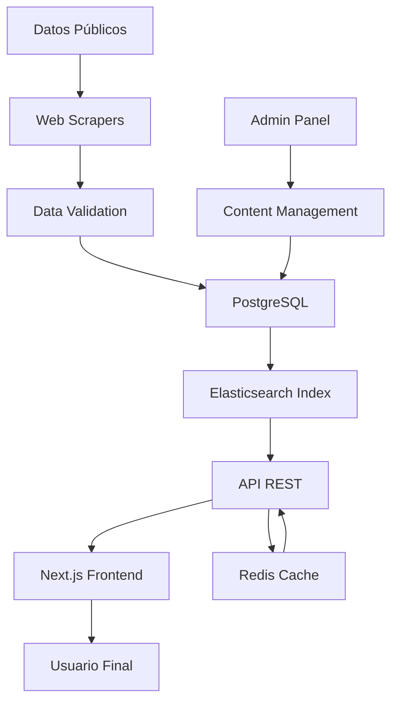

# 🏗️ Arquitectura de PoliticaMex

## Stack Tecnológico Recomendado

### 🎨 Frontend
- **Next.js 14** (App Router) - SSR/SSG para SEO óptimo
- **TypeScript** - Seguridad de tipos para datos críticos
- **Tailwind CSS** - Sistema de diseño escalable
- **Shadcn/ui** - Componentes accesibles (WCAG 2.1)
- **React Query** - Gestión de estado del servidor
- **Framer Motion** - Animaciones fluidas

### ⚙️ Backend
- **Node.js + Express** - API REST escalable
- **Prisma ORM** - Type-safe database access
- **PostgreSQL** - Base de datos relacional principal
- **Redis** - Caché distribuido y sesiones
- **Elasticsearch** - Motor de búsqueda avanzado

### 🔐 Autenticación & Seguridad
- **NextAuth.js** - Autenticación OAuth2
- **JWT** - Tokens seguros
- **Helmet.js** - Headers de seguridad
- **Rate Limiting** - Protección DDoS

### 📊 Datos & Analytics
- **Apache Kafka** - Streaming de actualizaciones
- **InfluxDB** - Métricas de uso
- **Grafana** - Dashboards de monitoreo

### ☁️ Infraestructura
- **Docker** - Containerización
- **Kubernetes** - Orquestación (producción)
- **Vercel** - Hosting frontend
- **Railway/DigitalOcean** - Backend services
- **Cloudflare** - CDN + WAF

## 📁 Estructura de Archivos Propuesta

```
politica-mex/
├── 📱 apps/
│   ├── web/                          # Next.js App (Frontend)
│   │   ├── app/
│   │   │   ├── (auth)/
│   │   │   ├── partidos/
│   │   │   ├── funcionarios/
│   │   │   ├── transparencia/
│   │   │   ├── constitucion/
│   │   │   └── api/
│   │   ├── components/
│   │   │   ├── ui/                   # Shadcn components
│   │   │   ├── partidos/
│   │   │   ├── funcionarios/
│   │   │   └── common/
│   │   ├── lib/
│   │   └── styles/
│   ├── api/                          # Backend API (Express)
│   │   ├── src/
│   │   │   ├── controllers/
│   │   │   ├── services/
│   │   │   ├── models/
│   │   │   ├── middleware/
│   │   │   └── routes/
│   │   ├── prisma/
│   │   └── tests/
│   └── mobile/                       # React Native (Futuro)
│
├── 📦 packages/
│   ├── ui/                           # Componentes compartidos
│   ├── database/                     # Esquemas Prisma
│   ├── types/                        # TypeScript definitions
│   ├── utils/                        # Utilidades compartidas
│   └── config/                       # Configuraciones
│
├── 🗄️ data/
│   ├── partidos/                     # JSONs de partidos políticos
│   ├── funcionarios/                 # Base de datos funcionarios
│   ├── salarios/                     # Datos de transparencia
│   ├── constitucion/                 # Artículos constitucionales
│   └── migrations/                   # Scripts de migración
│
├── 🔧 tools/
│   ├── scrapers/                     # Web scrapers para datos públicos
│   ├── validators/                   # Validadores de datos
│   └── generators/                   # Generadores de contenido
│
├── 📚 docs/
│   ├── api/                          # Documentación API
│   ├── deployment/                   # Guías de despliegue
│   └── contributing/                 # Guías de contribución
│
├── 🧪 tests/
│   ├── e2e/                          # Tests end-to-end
│   ├── integration/                  # Tests de integración
│   └── performance/                  # Tests de rendimiento
│
├── 🚀 infrastructure/
│   ├── docker/                       # Dockerfiles
│   ├── kubernetes/                   # Manifiestos K8s
│   ├── terraform/                    # Infrastructure as Code
│   └── monitoring/                   # Configuración Grafana/Prometheus
│
└── 📋 scripts/
    ├── build/                        # Scripts de construcción
    ├── deploy/                       # Scripts de despliegue
    └── maintenance/                  # Scripts de mantenimiento
```

## 🗃️ Modelo de Base de Datos

### Entidades Principales

```sql
-- Partidos Políticos
Partidos (id, nombre, siglas, color, logo_url, fundacion, ideologia)

-- Funcionarios Públicos
Funcionarios (id, nombre, cargo, nivel, partido_id, salario, fecha_inicio)

-- Cargos y Niveles
Cargos (id, nombre, nivel, descripcion, salario_base)
Niveles (id, nombre, jerarquia) -- Municipal, Estatal, Federal

-- Transparencia
TransparenciaSalarial (id, funcionario_id, periodo, salario_bruto, compensaciones)
HistorialCargos (id, funcionario_id, cargo_anterior, fecha_inicio, fecha_fin)

-- Contenido Educativo
ArticulosConstitucion (id, numero, titulo, contenido, explicacion_simple)
PropuestasPartidos (id, partido_id, tema, propuesta, fecha_actualizacion)
```

## 🔄 Flujo de Datos



## 🚀 Fases de Implementación

### Fase 1: MVP (2-3 meses)
- Migración a Next.js
- Base de datos PostgreSQL
- API básica de partidos
- Diseño responsive mejorado

### Fase 2: Datos Dinámicos (3-4 meses)
- Sistema de funcionarios
- Integración Elasticsearch
- Panel de administración
- Web scrapers automatizados

### Fase 3: Características Avanzadas (4-6 meses)
- Búsqueda inteligente
- Comparador de propuestas
- Dashboard de transparencia
- API pública

### Fase 4: Escalabilidad (6+ meses)
- App móvil React Native
- Machine Learning para análisis
- Integración redes sociales
- Alertas en tiempo real

## 📊 Consideraciones de Rendimiento

- **CDN**: Cloudflare para assets estáticos
- **Cache Strategy**: Redis para API responses
- **Database**: Read replicas para consultas
- **Search**: Elasticsearch para búsquedas complejas
- **Monitoring**: Grafana + Prometheus
- **Error Tracking**: Sentry

## 🔒 Seguridad y Compliance

- **HTTPS**: TLS 1.3 obligatorio
- **CORS**: Configuración restrictiva
- **Input Validation**: Sanitización completa
- **SQL Injection**: Prevención con Prisma ORM
- **Rate Limiting**: Por IP y usuario
- **Backup**: Automatizado diario con encriptación

---

**Ventajas de esta arquitectura:**
- ✅ Escalabilidad horizontal
- ✅ SEO optimizado para máximo alcance
- ✅ Accesibilidad WCAG 2.1
- ✅ Rendimiento superior
- ✅ Mantenibilidad a largo plazo
- ✅ Compliance con normativas de transparencia