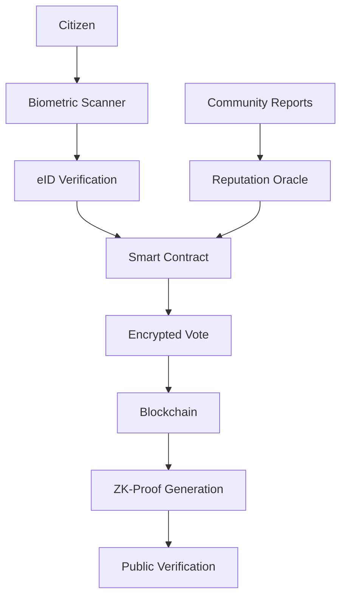

# 🗳️ Sistema de E-Voting con Reputación

## 🎯 Visión del E-Voting Inteligente

Sistema de votación electrónica que combina:
- **Votación Tradicional** - Elecciones oficiales
- **Votación por Reputación** - Score continuo de funcionarios
- **Transparencia Social** - Red social cívica para reportes
- **Blockchain Audit** - Inmutabilidad y verificabilidad

## 🏗️ Arquitectura del Sistema

### 🔐 Núcleo de Seguridad
```
Biometric Auth → Smart Contracts → Encrypted Ballots → ZK-Proofs
```

### 📊 Componentes Principales

#### 1. **Sistema de Identidad Digital (eID)**
```typescript
interface CitizenIdentity {
  id: string;
  curp: string;
  biometricHash: string;
  voterRegistration: VoterStatus;
  reputationScore: number;
  verificationLevel: 'basic' | 'verified' | 'trusted';
}
```

#### 2. **Contratos Inteligentes de Votación**
```solidity
contract VotingContract {
    mapping(address => bool) hasVoted;
    mapping(uint => uint) candidateVotes;
    mapping(address => uint) reputationScores;

    function castVote(uint candidateId) external;
    function updateReputation(address official, int change) external;
}
```

#### 3. **API de Red Social Cívica**
```typescript
// Reportes de Transparencia
interface CorruptionReport {
  id: string;
  reportedOfficial: string;
  evidence: Evidence[];
  reporterReputation: number;
  verificationStatus: 'pending' | 'verified' | 'false';
  communityVotes: {upvotes: number, downvotes: number};
}

// Sistema de Reputación
interface ReputationSystem {
  calculateScore(actions: OfficialAction[]): number;
  updateFromReport(report: CorruptionReport): void;
  getCommunityTrust(officialId: string): TrustMetrics;
}
```

## 🔍 Características Principales

### 🗳️ Tipos de Votación

#### **Votación Oficial (Elecciones)**
- Biometría + eID obligatorio
- Una vez por elección
- Blockchain público auditado
- Zero-knowledge proofs para privacidad

#### **Votación de Reputación (Continua)**
- Rating continuo de funcionarios
- Basado en performance y transparencia
- Weighted by citizen reputation
- Updates en tiempo real

#### **Votación de Confianza (Social)**
- Verify/dispute corruption reports
- Community moderation
- Crowdsourced fact-checking
- Gamified participation

### 🔒 Seguridad Multi-Capa



### 📱 Interfaces de Usuario

#### **Ciudadano Regular**
- Vote en elecciones oficiales
- Rate funcionarios públicos
- Report corruption con evidencia
- View transparency dashboards

#### **Funcionario Público**
- View reputation metrics
- Respond to allegations
- Publish transparency reports
- Engage with constituents

#### **Auditor Electoral**
- Monitor voting integrity
- Verify blockchain records
- Investigate anomalies
- Generate compliance reports

## 🛠️ Stack Tecnológico E-Voting

### Blockchain Layer
- **Ethereum/Polygon** - Smart contracts
- **IPFS** - Distributed storage
- **Chainlink** - External data oracles
- **ZK-SNARKs** - Privacy preservation

### Backend Services
- **Node.js + Fastify** - High-performance API
- **PostgreSQL** - Relational data
- **MongoDB** - Social network data
- **Redis** - Real-time updates

### Frontend Applications
- **Next.js** - Web platform
- **React Native** - Mobile voting app
- **Progressive Web App** - Offline capability

### Security Infrastructure
- **Hardware Security Modules (HSM)**
- **Multi-signature wallets**
- **Biometric authentication**
- **End-to-end encryption**

## 📊 Schema de Base de Datos

```sql
-- Votaciones Oficiales
CREATE TABLE elections (
    id UUID PRIMARY KEY,
    name VARCHAR(255),
    type election_type,
    start_date TIMESTAMP,
    end_date TIMESTAMP,
    blockchain_address VARCHAR(42)
);

-- Sistema de Reputación
CREATE TABLE reputation_scores (
    official_id UUID,
    citizen_id UUID,
    score INTEGER CHECK (score BETWEEN 1 AND 5),
    category reputation_category,
    timestamp TIMESTAMP,
    blockchain_tx VARCHAR(66)
);

-- Reportes de Corrupción
CREATE TABLE corruption_reports (
    id UUID PRIMARY KEY,
    reported_official UUID,
    reporter_id UUID,
    evidence_hash VARCHAR(64),
    description TEXT,
    verification_status VARCHAR(20),
    community_score INTEGER,
    created_at TIMESTAMP
);

-- Red Social Cívica
CREATE TABLE civic_posts (
    id UUID PRIMARY KEY,
    author_id UUID,
    content TEXT,
    post_type post_type,
    related_official UUID,
    upvotes INTEGER DEFAULT 0,
    downvotes INTEGER DEFAULT 0,
    created_at TIMESTAMP
);
```

## 🎮 Gamificación Cívica

### Sistema de Puntos
- **Voter Points** - Por participar en elecciones
- **Transparency Points** - Por reportes verificados
- **Community Points** - Por moderación efectiva
- **Engagement Points** - Por participación continua

### Niveles de Ciudadano
1. **Citizen** (0-100 pts) - Voto básico
2. **Engaged** (101-500 pts) - Reports + ratings
3. **Trusted** (501-1000 pts) - Community moderation
4. **Guardian** (1000+ pts) - Advanced verification

## 🔐 Protocolo de Seguridad

### Proceso de Votación Segura
```typescript
async function secureVote(voterBiometric: string, candidateId: string) {
  // 1. Biometric verification
  const identity = await verifyBiometric(voterBiometric);

  // 2. Check eligibility
  const eligible = await checkVotingEligibility(identity.curp);

  // 3. Generate ZK-proof
  const proof = await generateZKProof(identity, candidateId);

  // 4. Submit to blockchain
  const tx = await votingContract.castSecureVote(proof);

  // 5. Store encrypted audit trail
  await storeAuditRecord(identity.id, tx.hash);
}
```

### Anti-Fraud Measures
- **Biometric deduplication**
- **IP/device fingerprinting**
- **Behavioral analysis**
- **Community verification**
- **Blockchain immutability**

## 📈 Implementación por Fases

### Fase 1: Fundación (6 meses)
- Blockchain infrastructure
- eID system integration
- Basic voting interface
- Security audits

### Fase 2: Social Network (4 meses)
- Corruption reporting system
- Community verification
- Reputation algorithms
- Mobile applications

### Fase 3: Advanced Features (6 meses)
- ZK-proof implementation
- Real-time analytics
- AI-powered fraud detection
- Integration with government systems

### Fase 4: Deployment (3 meses)
- Pilot municipal elections
- Security penetration testing
- Training programs
- Full rollout preparation

## ⚖️ Consideraciones Legales

### Compliance Requirements
- **INAI** transparency standards
- **Electoral tribunal** approval
- **CURP** integration requirements
- **Data protection** (LGPDP)

### Audit Trail
- Every vote cryptographically signed
- Immutable blockchain records
- Zero-knowledge voter privacy
- Public verification capabilities

---

**Este sistema combina la seguridad de blockchain con la transparencia de redes sociales para crear una democracia más participativa y confiable.**