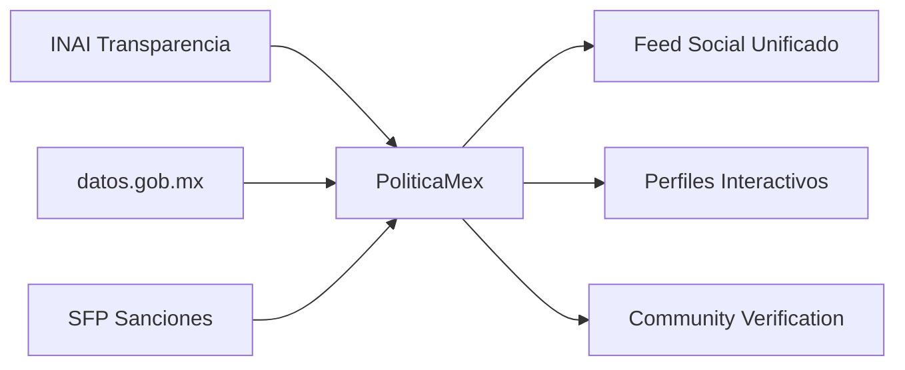

# 🌐 PoliticaMex: Red Social de Transparencia Gubernamental

## 🎯 Visión Redefinida (Basada en Investigación)

**PoliticaMex se posiciona como la primera red social dedicada exclusivamente a la transparencia gubernamental mexicana, complementando (no compitiendo) con las plataformas existentes del gobierno.**

---

## 📊 Análisis del Ecosistema Actual

### ✅ **Lo que YA existe:**
- **INE**: E-voting limitado (solo mexicanos en extranjero)
- **INAI**: Plataforma Nacional de Transparencia (solicitudes de información)
- **datos.gob.mx**: Datasets abiertos fragmentados
- **SFP**: Registro de Servidores Sancionados (solo sanciones)
- **gob.mx**: Portal unificado de trámites

### ❌ **Lo que NO existe:**
- **Red social unificada** de funcionarios públicos
- **Perfiles completos** con trayectoria profesional
- **Interacción ciudadano-funcionario** en tiempo real
- **Sistema de reputación** basado en desempeño
- **Crowdsourced transparency** con verificación comunitaria

---

## 🚀 Propuesta de Valor Única

### **"LinkedIn + Twitter + Wikipedia para Funcionarios Públicos"**

#### 🏛️ **Para Funcionarios:**
- **Perfil profesional público** - CV, logros, proyectos
- **Canal de comunicación directo** con ciudadanos
- **Dashboard de transparencia** personal
- **Métricas de impacto** social cuantificables

#### 👥 **Para Ciudadanos:**
- **Directorio searchable** de todos los funcionarios
- **Ratings y reviews** como Google/Yelp
- **Seguimiento de promesas** de campaña
- **Alertas de actividad** de funcionarios que sigues

#### 🏢 **Para Instituciones:**
- **API pública** para integrar con sistemas existentes
- **Analytics de transparencia** institucional
- **Herramientas de compliance** automatizadas

---

## 🎮 Diferenciación Estratégica

### **1. Complementar, no Competir**


### **2. Gamificación Cívica**
- **Transparency Score** - Público para cada funcionario
- **Citizen Badges** - Reconocimiento por participación
- **Leaderboards** - Rankings por transparencia/efectividad
- **Impact Tracking** - Medición cuantificada de logros

### **3. Social Features Únicas**
- **Follow/Unfollow** funcionarios
- **Notification System** - Nuevas decisiones, gastos, proyectos
- **Comments & Discussions** - Debate público moderado
- **Fact-Checking Crowdsourced** - Verificación comunitaria

---

## 🏗️ Arquitectura Social Network

### **Tipos de Usuarios:**

#### **👤 Ciudadanos**
```typescript
interface CitizenProfile {
  basicInfo: PersonalData;
  reputationScore: number; // 0-1000
  verificationLevel: 'Basic' | 'Verified' | 'Trusted' | 'Guardian';
  followedOfficials: Official[];
  contributionHistory: Contribution[];
  badges: Badge[];
}
```

#### **🏛️ Funcionarios Públicos**
```typescript
interface OfficialProfile {
  personalInfo: OfficialData;
  currentPosition: Position;
  careerHistory: Position[];
  transparencyMetrics: {
    responseRate: number;
    publicEngagement: number;
    promisesFulfilled: number;
    budgetTransparency: number;
  };
  socialStats: {
    followers: number;
    avgRating: number;
    totalRatings: number;
    postsCount: number;
  };
}
```

#### **🏢 Instituciones**
```typescript
interface InstitutionProfile {
  name: string;
  level: 'Federal' | 'State' | 'Municipal';
  officials: Official[];
  transparencyScore: number;
  publicProjects: Project[];
  budgetTransparency: BudgetData[];
}
```

---

## 📱 Features de Red Social

### **1. Feed Principal**
- **Timeline estilo Twitter** con actividades de funcionarios
- **Filtros inteligentes** por nivel, partido, región
- **Trending topics** en transparencia
- **Algoritmo de relevancia** basado en interés ciudadano

### **2. Perfiles Interactivos**
- **Stories de funcionarios** - Proyectos en curso
- **Live Q&A sessions** - AMAs públicos
- **Document sharing** - Informes, presupuestos
- **Photo/video updates** - Trabajo en campo

### **3. Sistema de Ratings**
```typescript
interface OfficialRating {
  categories: {
    transparency: number;      // 1-5
    effectiveness: number;     // 1-5
    communication: number;     // 1-5
    integrity: number;         // 1-5
    responsiveness: number;    // 1-5
  };
  overallScore: number;
  reviewText?: string;
  evidence?: FileUpload[];
}
```

### **4. Herramientas de Transparencia**
- **Budget Tracker** - Visualización de gastos en tiempo real
- **Promise Tracker** - Seguimiento de compromisos de campaña
- **Project Timeline** - Progreso de obras públicas
- **Conflict of Interest Detector** - Alertas automáticas

---

## 🔗 Integración con Ecosistema Existente

### **APIs de Integración:**

#### **Con INAI Transparencia:**
```javascript
// Importar solicitudes de información exitosas
async function importTransparencyRequests(officialId) {
  const requests = await inaiAPI.getRequestsByOfficial(officialId);
  return requests.map(req => ({
    type: 'transparency_request_fulfilled',
    score: +10,
    evidence: req.responseDocument
  }));
}
```

#### **Con datos.gob.mx:**
```javascript
// Sincronizar datasets públicos
async function syncGovernmentData() {
  const datasets = await datosGobAPI.getOfficialDatasets();
  return processIntoOfficialProfiles(datasets);
}
```

#### **Con Sistema de Sanciones (SFP):**
```javascript
// Alertas automáticas de sanciones
async function checkSanctions(officialId) {
  const sanctions = await sfpAPI.getSanctions(officialId);
  if (sanctions.length > 0) {
    await createCorruptionAlert(officialId, sanctions);
  }
}
```

---

## 📈 Estrategia de Adopción

### **Fase 1: MVP Social (3 meses)**
- ✅ Perfiles básicos de funcionarios federales
- ✅ Sistema de ratings ciudadanos
- ✅ Feed de actividades
- ✅ Integración con datos.gob.mx

### **Fase 2: Engagement Tools (6 meses)**
- 📱 App móvil nativa
- 🔔 Sistema de notificaciones push
- 💬 Comentarios y discussions
- 📊 Dashboard de analytics

### **Fase 3: Advanced Features (12 meses)**
- 🤖 AI para fact-checking automático
- 🔗 Blockchain para audit trail
- 📺 Live streaming de sesiones públicas
- 🌐 API pública para desarrolladores

### **Fase 4: Institucionalización (18 meses)**
- 🏛️ Adopción oficial por instituciones
- 📜 Certificación de transparencia
- 🌍 Expansión a otros países LATAM
- 🎓 Programa educativo cívico

---

## 💡 Características Innovadoras Únicas

### **1. Transparency Score Algorithm**
```typescript
function calculateTransparencyScore(official: Official): number {
  const factors = {
    responseRate: official.responseToRequests * 0.25,
    publicEngagement: official.socialInteraction * 0.20,
    budgetOpenness: official.budgetTransparency * 0.25,
    promiseTracking: official.campaignPromisesFulfilled * 0.15,
    citizenRatings: official.averageRating * 0.15
  };

  return Object.values(factors).reduce((sum, val) => sum + val, 0);
}
```

### **2. Citizen Impact Tracking**
- **Legislation Influenced** - Por participación ciudadana
- **Corruption Prevented** - Reportes verificados
- **Transparency Increased** - Métricas cuantificables
- **Public Money Saved** - Auditoría ciudadana efectiva

### **3. Real-time Alerts**
- 🚨 **Corruption Alert** - Nuevas investigaciones
- 💰 **Budget Alert** - Gastos inusuales detectados
- 📋 **Promise Alert** - Incumplimiento de compromisos
- 🗳️ **Election Alert** - Candidatos con historial problemático

---

## 🎯 Métricas de Éxito

### **Impacto Social:**
- **Funcionarios registrados** activamente
- **Ciudadanos engaged** mensualmente
- **Corruption reports** verificados
- **Transparency improvements** medibles

### **Engagement:**
- **Daily Active Users** (ciudadanos)
- **Official Response Rate** (funcionarios)
- **Content Quality Score** (posts/updates)
- **Community Trust Index** (verificaciones exitosas)

---

## 🌟 Visión a 5 Años

**"Convertir a PoliticaMex en la plataforma de referencia para la transparencia gubernamental en América Latina, donde cada ciudadano pueda seguir, evaluar e interactuar con sus representantes públicos en tiempo real."**

### **Impacto Esperado:**
- 📈 **95%** de funcionarios federales con perfil activo
- 🏛️ **500+** instituciones públicas integradas
- 👥 **10M+** ciudadanos usuarios activos
- 🌍 **Expansion** a 5 países latinoamericanos
- 📊 **Mejora measurable** en índices de transparencia gubernamental

---

**Esta red social transformaría fundamentalmente la relación ciudadano-gobierno, creando accountability en tiempo real y convirtiendo la transparencia en un hábito social.** 🚀✨